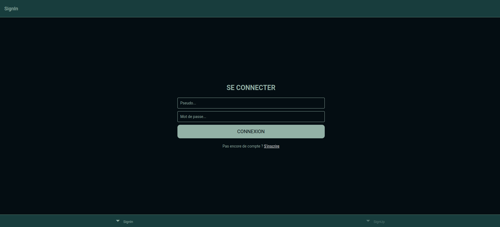
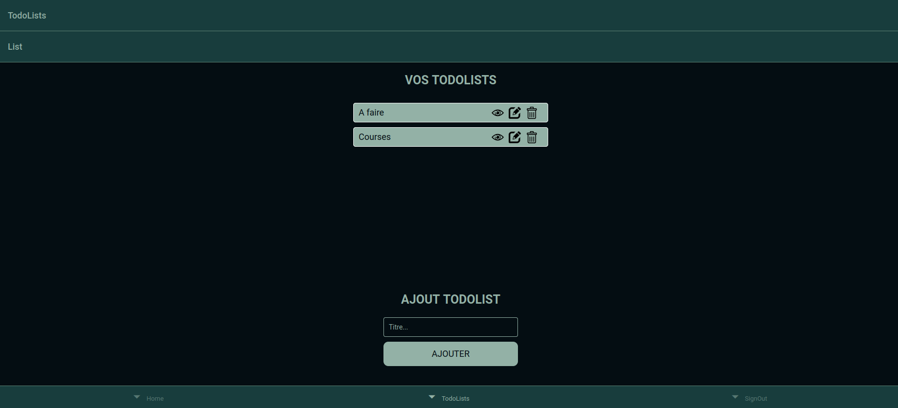
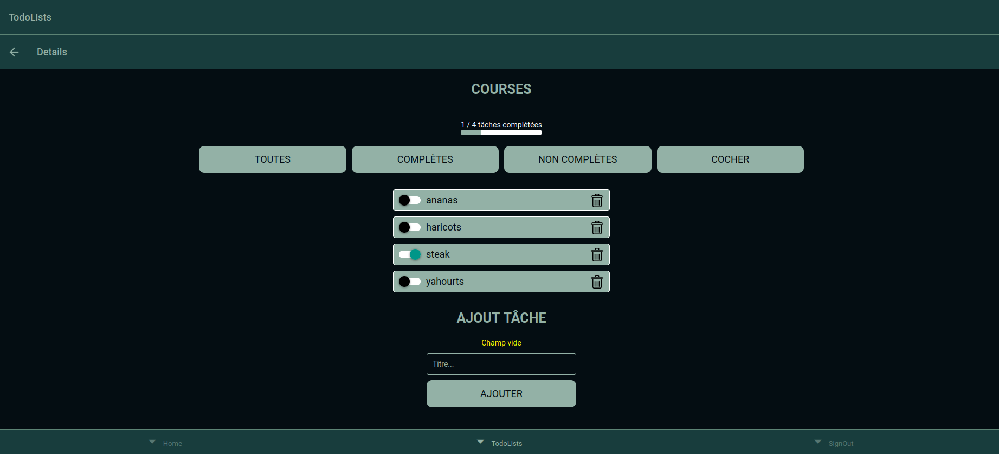
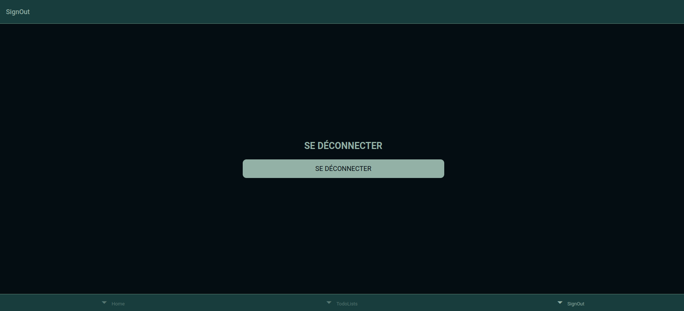

# Todolist-React
A web application built with React.js for managing to-do lists, using JavaScript, CSS, MySQL, and GraphQL. Users can interact with a database to create, edit, or delete entire to-do lists. Within each list, they can check or uncheck tasks, sort them, add new ones, or remove existing ones. I also implemented a progress bar that visually indicates how many tasks have been completed in each to-do list. I focused on both front-end development with React and back-end integration using MySQL and GraphQL.

# Instructions
$ npm run start $ node mon-serveur-graphql/index.js

# Images
<table>
	
  <tr>
  	<td></td>
    <td></td>
    <td></td>
  </tr>
</table>